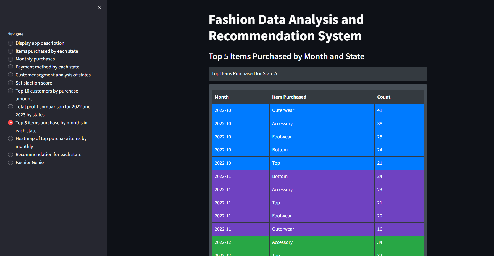
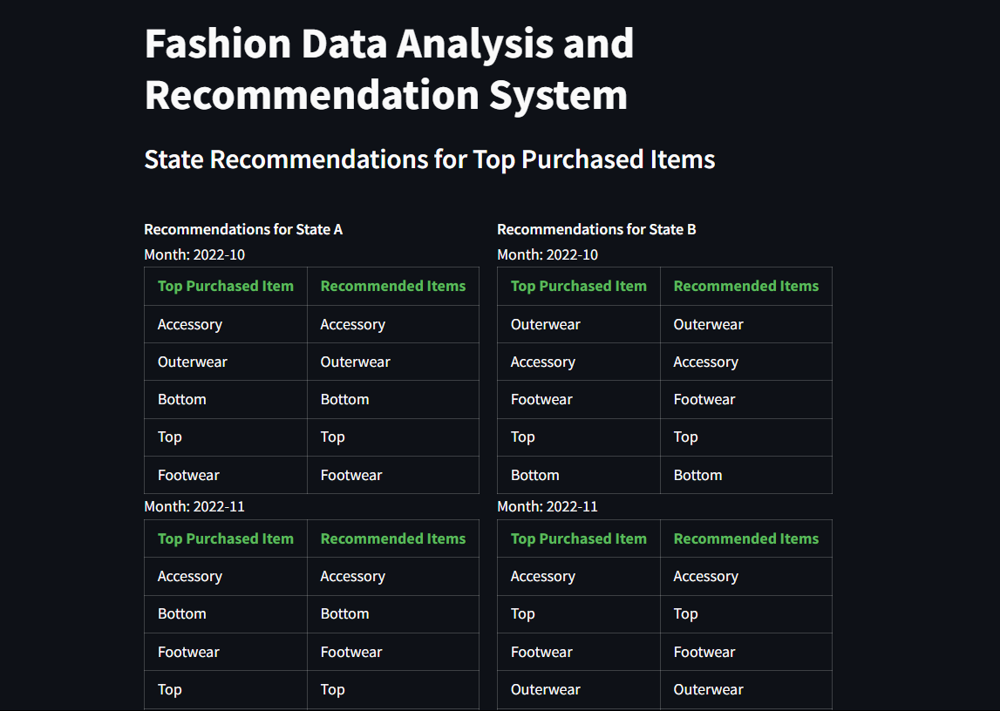
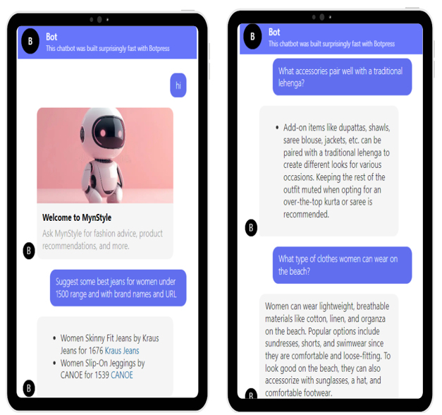

# Region-Based-Items-Recommender-system-and-Fashion-Data-Analysis
It is a Streamlit app that provides real-time, region-specific fashion recommendations based on purchase data. It features interactive visualizations and a chatbot for personalized fashion queries and suggestions tailored to local trends and events.

## Challenge
Customers often struggle to find trending fashion items specific to their region, especially during local festivals or occasions. Time-consuming searches and missed opportunities to connect with local trends can lead to decreased customer satisfaction and engagement.

## Impact
Time-consuming searches and missed opportunities to connect with local trends can lead to decreased customer satisfaction and engagement.

## Need
A solution to provide real-time, region-specific fashion recommendations to enhance the shopping experience on Myntra.

## Objective
Analyze real-time data to recommend trending styles based on the user’s region and provide fashion recommendations for local festivals and occasions.

## Features
1. **Region Trend Section:** Showcases trending products specific to a region.
2. **AI Chatbot:** Answers fashion-related questions in a particular region and provides product links.

## Solution
1. **Real-Time Data Analysis:** Utilize real-time purchase data to identify trending fashion items in specific regions.
2. **Region-Specific Recommendations:** Create a dedicated section for 'Region Trends' where users can quickly find popular items in their area.
3. **Occasion-Based Suggestions:** Leverage local festivals and events to tailor fashion recommendations that resonate with the cultural context of the region.
4. **Interactive Chatbot:** A chatbot to answer fashion-related queries and suggest trends in regions unknown to the user, providing direct product links.

## Implementation
1. **Data Acquisition:** Used random data from Kaggle, modified to create a representative dataset.
2. **Data Preprocessing:** Cleaned and structured the data to align with real-time analysis requirements.
3. **Trend Analysis:** Implemented algorithms to analyze purchase patterns and identify trending items.
4. **Recommendation Engine:** Developed a recommendation system to suggest region-specific fashion items.
5. **Chatbot Development:** Integrated a chatbot to handle fashion queries and provide product recommendations with direct links.
6. **User Interface:** Designed a user-friendly interface for easy access to region-specific trends.

## Technology Stack
- **Frontend:** React.js, Material UI
- **Database:** MongoDB
- **Chatbot:** Botpress, Myntra Products Dataset Kaggle
- **Backend:** Python and relevant libraries for analysis (Numpy, Pandas, Seaborn, Matplotlib, etc)
- **Dataset:** Fashion Retail Sales dataset Kaggle
- **Deployment:** GitHub

## Benefits to Myntra
1. **Enhanced User Experience:** Quick access to region-specific trends saves time and improves customer satisfaction.
2. **Increased Engagement:** Personalized recommendations and helpful chatbot encourage more frequent visits.
3. **Boosted Sales:** Targeted suggestions during local festivals and occasions can drive higher sales.
4. **Brand Loyalty:** Providing a tailored shopping experience fosters customer loyalty and repeat business.
5. **Market Insights:** Real-time data analysis offers valuable insights into regional preferences and emerging trends, aiding strategic decision-making.

## Running the App
To run the Fashion Data Analysis and Recommendation System, use these following steps:
1. Clone the repository
2. Run the follwing command `streamlit run app.py`

## Screenshots

